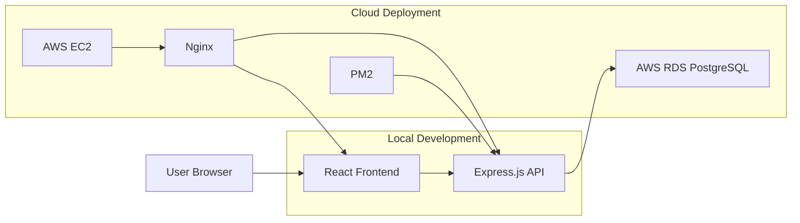

# **Bookscape: A Literary Discovery and Reading Platform**  

**CIT550 - Group22: Created by Tong Li, Wanyu Song, Lingyan Xuan, and Yuan Qian.**

## **Project Overview**  
Bookscape is a comprehensive literary platform designed to help users discover, explore, and enjoy books and authors. Our platform includes the following features:

- **Home Page**: A welcoming hub for users.  
- **Book Search Page**: Allows users to search for books using various filters.  
- **Book Recommendation Page**: Personalized book recommendations based on user preferences.  
- **Book/Ebook Information Page**: Detailed information about books and ebooks.  
- **Book Online Reading Page**: Enables users to read ebooks directly on the platform.  
- **Author Search Page**: Search for authors and their works.  
- **Author Information Page**: Explore detailed author profiles.  
- **User Gallery Page**: A personalized space for users to save and organize their favorite books.

The database is hosted on **AWS RDS PostgreSQL** for reliability and scalability. The application can run locally during development or be deployed to **AWS EC2** with Nginx and PM2.

## **Architecture**



In production, Nginx serves the React build and proxies `/api/*` requests to the Express backend. The backend connects to PostgreSQL on AWS RDS using environment variables.

## **Project Structure**  
The repository is organized as follows:

- **`client/`**: Contains frontend development files.  
  - Key folders:
    - **`src/components/`**: Reusable components for the user interface.  
    - **`src/pages/`**: Page-specific React components.  
- **`server/`**: Contains backend development files.
- **`deploy/`**: Contains sample EC2 deployment configuration for Nginx and PM2.
- **`data cleanning/`**: Contains data cleanning files. 

## How to Run the Project

### 0. Configure Server Environment Variables
Create a local environment file from the example:

```bash
cd server
cp .env.example .env
```

Fill in the RDS PostgreSQL values:

```bash
RDS_HOST=your-rds-endpoint.amazonaws.com
RDS_PORT=5432
RDS_USER=your_database_user
RDS_PASSWORD=your_database_password
RDS_DB=your_database_name
SERVER_HOST=localhost
SERVER_PORT=8081
```

### 1. Start the Server
Navigate to the `server` folder and run the following commands:
```bash
cd server
npm install
npm start
```

### 2. Start the Client
Navigate to the `client` folder and run the following commands:
```bash
cd client
npm install
npm start
```

### 3. Access the Application
Once both the server and client are running, open your browser and navigate to:
```bash
http://localhost:3000
```

## Production Build

For EC2 deployment, configure the frontend API base URL:

```bash
cd client
cp .env.production.example .env.production
npm install
npm run build
```

The recommended production value is:

```bash
REACT_APP_API_BASE_URL=/api
```

## EC2 Deployment Outline

1. Launch an Ubuntu EC2 instance.
2. Configure the EC2 security group to allow SSH `22`, HTTP `80`, and optionally HTTPS `443`.
3. Configure the RDS security group to allow PostgreSQL `5432` only from the EC2 security group.
4. Install Node.js, npm, Nginx, PM2, and git on EC2.
5. Copy or clone this project to `/var/www/bookscape`.
6. Create `/var/www/bookscape/server/.env` with the RDS credentials.
7. Build the React frontend with `REACT_APP_API_BASE_URL=/api`.
8. Copy `deploy/nginx-bookscape.conf.example` to the Nginx sites config.
9. Start the backend with PM2 using `deploy/ecosystem.config.js`.

Example PM2 command:

```bash
pm2 start deploy/ecosystem.config.js
pm2 save
```
