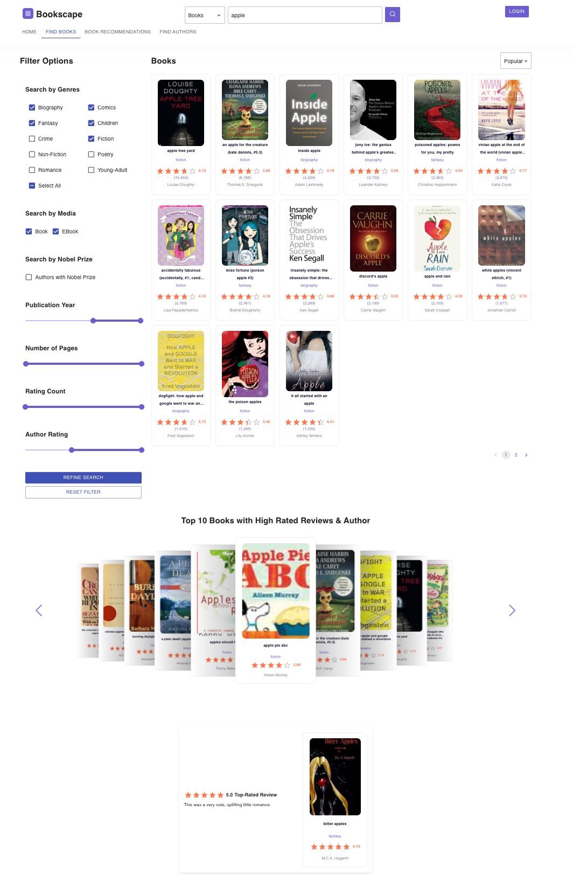
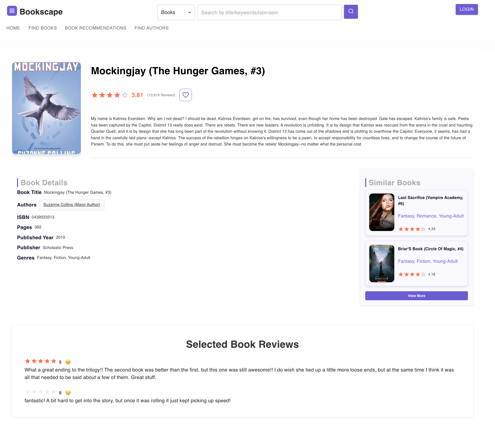
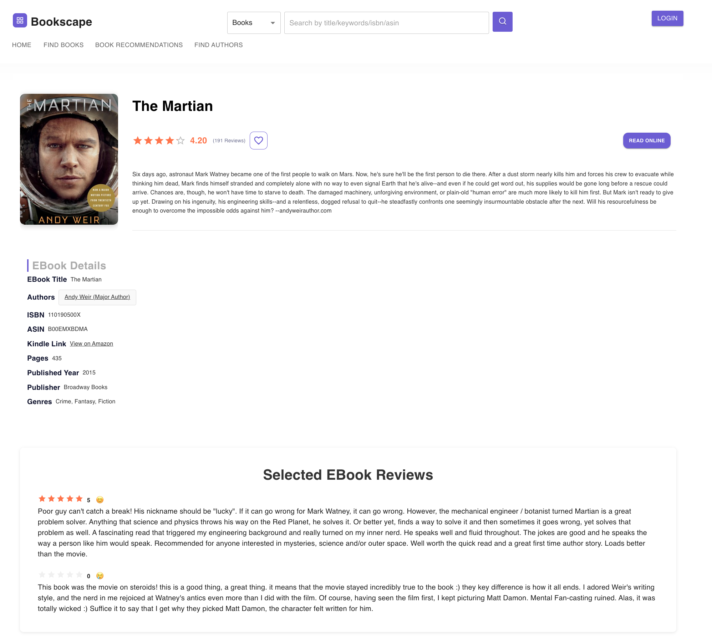
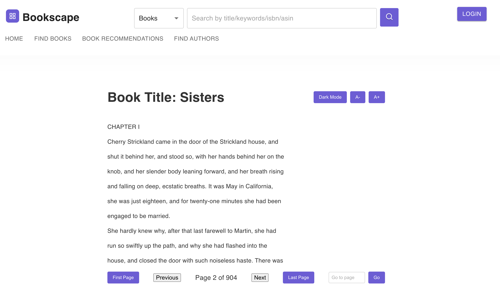
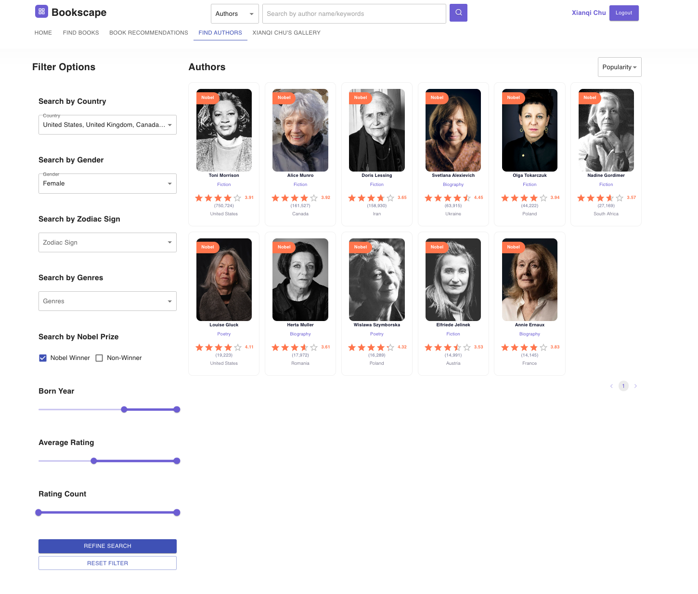
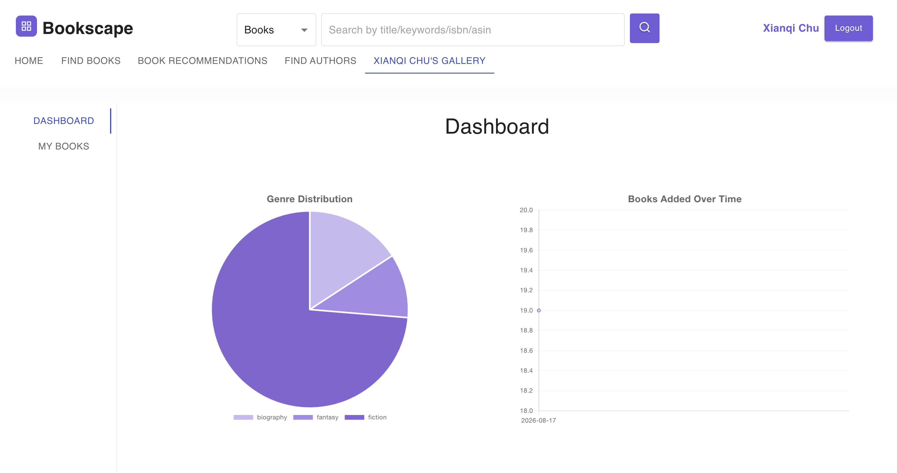
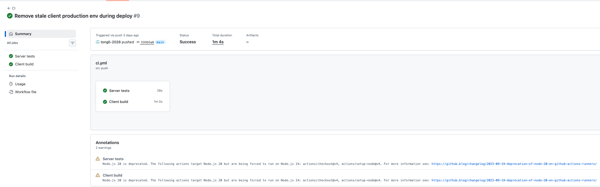
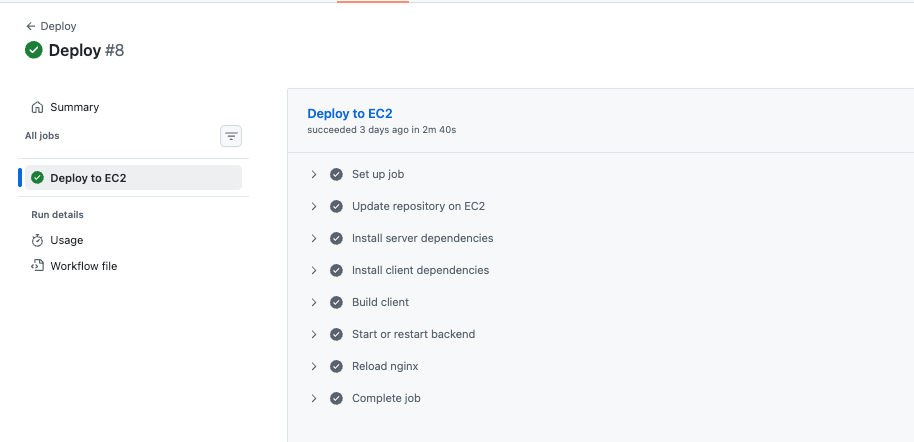
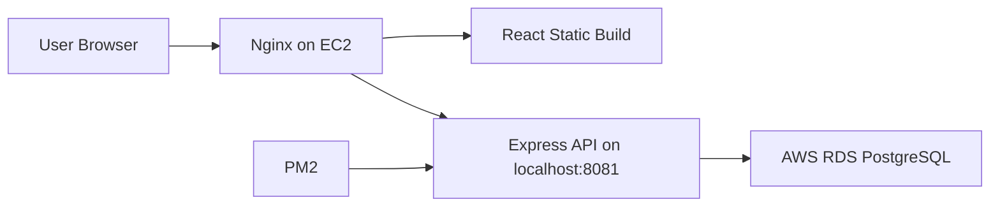

# Bookscape

Bookscape is a literary discovery and reading platform for exploring books, ebooks, authors, reviews, genres, and personalized reading galleries.

## Demo

### Home Page


### Book Search Page


### Book Recommendation Page


### Book Detail Page


### Ebook Detail Page


### Online Reading Page


### Author Search Page


### Author Detail Page


### User Gallery Page


### CI Workflow


### CD Workflow


## Features

- Browse top-rated and popular books from the home page.
- Search books by genre, media type, Nobel Prize filter, and rating/page ranges.
- View detailed book and ebook pages with authors, genres, ratings, reviews, and similar recommendations.
- Read available online book full text directly in the app.
- Search and explore author profiles, author books, similar authors, and Nobel Literature winners.
- Create an account, log in, and save books to a personal gallery.

## Tech Stack

- Frontend: React, React Router, Material UI, Axios
- Backend: Node.js, Express, Passport, JWT, bcrypt
- Database: PostgreSQL on AWS RDS
- Deployment: AWS EC2, Nginx, PM2
- Automation: GitHub Actions CI and self-hosted EC2 deployment workflow

## Architecture



In production, Nginx serves the React build from `client/build` and proxies backend routes to the Express server running on `127.0.0.1:8081`.

## Project Structure

```text
bookscape/
  client/     React frontend
  server/     Express backend
  db/         PostgreSQL schema, indexes, verification, and view SQL files
  deploy/     Example Nginx and PM2 deployment configuration
  .github/    GitHub Actions CI/CD workflows
```

Large datasets, cleaned datasets, local secrets, build outputs, dependencies, and data-cleaning notebooks/scripts are intentionally ignored by Git.

## Local Setup

### 1. Configure Backend Environment

Create a backend environment file:

```bash
cd server
cp .env.example .env
```

Fill in your PostgreSQL and server values:

```bash
RDS_HOST=your-rds-endpoint.amazonaws.com
RDS_PORT=5432
RDS_USER=your_database_user
RDS_PASSWORD=your_database_password
RDS_DB=your_database_name
SERVER_HOST=localhost
SERVER_PORT=8081
```

Google OAuth values are optional for local development unless you are testing Google login.

### 2. Start the Backend

```bash
cd server
npm install
npm start
```

The API runs at:

```text
http://localhost:8081
```

### 3. Start the Frontend

Open a second terminal:

```bash
cd client
npm install
npm start
```

The React app runs at:

```text
http://localhost:3000
```

## Production Build

For an EC2/Nginx deployment where frontend and backend are served from the same host, use:

```bash
cd client
npm install
npm run build
```

For EC2/Nginx deployment, no production API base URL is required. The frontend defaults to same-origin API requests in production.

## EC2 Deployment Outline

1. Launch an Ubuntu EC2 instance.
2. Allow inbound SSH `22` from your IP and HTTP `80` from the internet.
3. Allow RDS PostgreSQL `5432` only from the EC2 security group.
4. Install Node.js, npm, git, Nginx, and PM2 on EC2.
5. Clone the repo to `/var/www/bookscape`.
6. Create `/var/www/bookscape/server/.env` with RDS credentials.
7. Install backend dependencies and start the API with PM2:

```bash
cd /var/www/bookscape
cd server
npm install
cd ..
pm2 start deploy/ecosystem.config.js
pm2 save
```

8. Build the frontend:

```bash
cd /var/www/bookscape/client
npm install
npm run build
```

9. Configure Nginx using `deploy/nginx-bookscape.conf.example`, then restart Nginx:

```bash
sudo cp /var/www/bookscape/deploy/nginx-bookscape.conf.example /etc/nginx/sites-available/bookscape
sudo ln -s /etc/nginx/sites-available/bookscape /etc/nginx/sites-enabled/bookscape
sudo rm -f /etc/nginx/sites-enabled/default
sudo nginx -t
sudo systemctl restart nginx
```

## CI/CD

GitHub Actions runs CI on pushes to `main`:

- Install and test the backend.
- Install and build the frontend.

A separate deployment workflow can run on a self-hosted runner installed on the EC2 instance. After CI succeeds, it updates the EC2 working tree, installs dependencies, rebuilds the frontend, restarts the PM2 backend process, and restarts Nginx.

## Notes

- Do not commit `.env`, database credentials, OAuth secrets, datasets, or generated build folders.
- Raw EC2 public IP addresses are not accepted as Google OAuth redirect URIs. Use a domain name and HTTPS if Google login is required in production.
